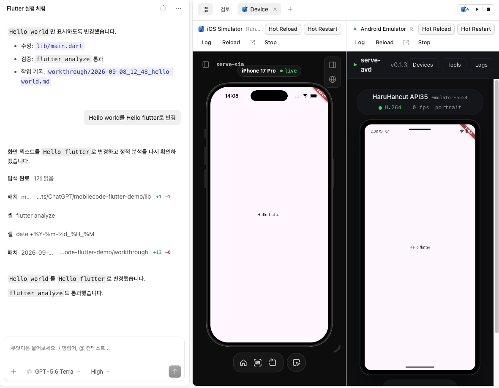

<h1 align="center">MobileCode Flutter</h1>
<p align="center">Flutter 앱을 AI 에이전트와 함께 개발하고, iOS·Android에서 바로 확인하는 코딩 환경</p>

> [!IMPORTANT]
> ## 🟣 Flutter 지원 버전
> 이 저장소는 Flutter 앱을 iOS Simulator와 Android Emulator에서 동시에 실행하고, Device 패널에서 **실시간 미리보기·Hot Reload·Hot Restart**를 사용할 수 있도록 확장한 MobileCode 버전입니다.

> 원본 프로젝트: [hsandhu/mobilecode](https://github.com/hsandhu/mobilecode)

MobileCode Flutter은 AI 에이전트가 Flutter 코드를 수정한 뒤 `flutter run --machine`으로 앱을 실행하고, 빌드·실행 로그와 기기 화면을 같은 세션에서 확인하도록 합니다. iOS와 Android를 나란히 열어 플랫폼별 결과를 비교할 수 있습니다.

<p align="center">
  
</p>

### 제공 기능

- `pubspec.yaml`을 기준으로 Flutter 프로젝트를 감지합니다.
- iOS Simulator와 Android Emulator에서 Flutter 앱을 실행합니다.
- Device 패널에서 두 기기 화면을 나란히 확인합니다.
- **Hot Reload**로 Dart 변경을 현재 앱 상태를 유지한 채 반영합니다.
- **Hot Restart**로 Dart 앱을 다시 시작합니다.
- 에이전트가 `device_run` 도구로 실행·상태 확인·중지·Hot Reload·Hot Restart를 수행할 수 있습니다.
- 빌드와 런타임 로그를 Device 패널에서 확인할 수 있습니다.

현재 자동 화면 분석, UI 터치 자동화, `--flavor`, `--dart-define`, 별도 진입 파일 선택, 물리 기기 미리보기는 제공하지 않습니다.

### 요구 사항

- Bun `1.4.1`
- Flutter SDK (`flutter` 명령이 `PATH`에 있어야 함)
- iOS 실행: macOS, Xcode, iOS Simulator
- Android 실행: Android SDK, JDK, Android Emulator 또는 AVD
- 웹 UI 실행: `PATH`에 Node.js `22.12` 이상

현재 GitHub Release 바이너리는 제공하지 않습니다. 아래 소스 설치 방식으로 실행해야 합니다.

### 설치

```bash
git clone --branch flutter-release --single-branch https://github.com/bear2u/flutter-mobilecode.git
cd flutter-mobilecode
bun install --frozen-lockfile
```

설치가 끝나면 CLI를 실행할 수 있습니다.

```bash
bun run --cwd packages/opencode src/index.ts
```

CLI는 AI 대화와 도구 실행에 적합합니다. Flutter 기기 화면과 실행 제어는 아래 웹 UI 또는 데스크톱 앱에서 사용합니다.

### 웹 UI 실행

터미널 두 개에서 다음 명령을 각각 실행합니다.

```bash
# 터미널 1: 백엔드
bun run --cwd packages/opencode src/index.ts serve --hostname 127.0.0.1 --port 4096
```

```bash
# 터미널 2: 웹 UI
bun --cwd packages/app dev -- --host 127.0.0.1 --port 4444
```

브라우저에서 [http://127.0.0.1:4444](http://127.0.0.1:4444)를 엽니다.

### Flutter 앱 사용 방법

1. 웹 UI에서 Flutter 프로젝트 폴더를 추가합니다. 프로젝트 루트에는 `pubspec.yaml`과 `ios/` 또는 `android/` 폴더가 있어야 합니다.
2. 새 세션을 열면 오른쪽에 **Device** 탭이 자동으로 나타납니다.
3. 상단의 **Play** 버튼을 누르면 iOS와 Android 앱을 빌드하고 실행합니다.
4. 에이전트에게 Flutter 작업을 요청합니다. 예: `로그인 화면을 만들고 iOS와 Android에서 실행해줘.`
5. Dart 파일을 수정한 뒤 **Hot Reload**를 누르면 현재 앱 상태를 유지한 채 화면에 반영됩니다. 앱 상태를 초기화해야 하면 **Hot Restart**를 누릅니다.
6. 실행 오류가 발생하면 **Log**에서 오류를 확인하거나, 에이전트에게 `device_run으로 실행 오류를 확인하고 수정해줘.`라고 요청합니다.

**Reload**는 Flutter 코드를 다시 실행하지 않습니다. Device 패널의 미리보기 프레임만 새로고침합니다.

### Device 실행 API

같은 기능은 서버 API로도 호출할 수 있습니다.

```text
GET  /api/device-preview?location[directory]=<프로젝트 경로>
POST /api/device-preview/start      { "platform": "ios" | "android" }
POST /api/device-preview/stop       { "platform": "ios" | "android" }
POST /api/device-preview/run        { "platform": "ios" | "android" }
POST /api/device-preview/run        { "platform": "ios" | "android", "action": "reload" | "restart" }
POST /api/device-preview/run/stop   { "platform": "ios" | "android" }
```

### 설정과 데이터

MobileCode Flutter은 OpenCode의 설정 형식과 저장 위치를 사용합니다. 기존 `opencode.json`, 모델 제공자 인증 정보, 플러그인, 스킬을 계속 사용할 수 있습니다.

- 설정: `~/.config/opencode`
- 데이터와 세션: `~/.local/share/opencode`
- 환경 변수 접두사: `OPENCODE_`

모델 제공자 연결과 일반 설정은 [OpenCode 문서](https://opencode.ai/docs)를 참고하세요.

### 개발

```bash
bun install
bun run --cwd packages/opencode src/index.ts serve --port 4096   # 백엔드
bun --cwd packages/app dev -- --port 4444                        # 웹 UI
bun --cwd packages/desktop dev                                   # 데스크톱 앱
```

변경한 패키지 디렉터리에서 `bun typecheck`를 실행해야 합니다. 예를 들어 Core 변경은 `packages/core`에서 `bun typecheck`로 확인합니다. 테스트도 각 패키지에서 실행합니다.

### macOS 앱 빌드

```bash
bun run build:macos
```

명령 하나로 의존성을 설치하고 서버를 번들링한 뒤 Electron 앱을 빌드합니다. 결과물인 `MobileCode.app`, `.dmg`, `.zip`은 `packages/desktop/dist`에 생성됩니다. 기본 빌드는 서명되지 않으므로 처음 실행할 때 앱을 우클릭한 뒤 열기를 선택하면 됩니다.

서명·공증된 앱을 만들려면 키체인의 Developer ID 인증서와 `APPLE_API_KEY`, `APPLE_API_KEY_ID`, `APPLE_API_ISSUER` 환경 변수를 설정한 뒤 `--sign`을 전달합니다. `--arch arm64|x64|universal`, `--channel dev|beta|prod`, `--skip-install` 옵션도 지원합니다.

### 라이선스

MIT. 이 저장소는 [MobileCode 원본](https://github.com/hsandhu/mobilecode)과 그 기반 프로젝트인 [OpenCode](https://github.com/anomalyco/opencode)의 저작권 고지 및 MIT 라이선스를 유지합니다.
